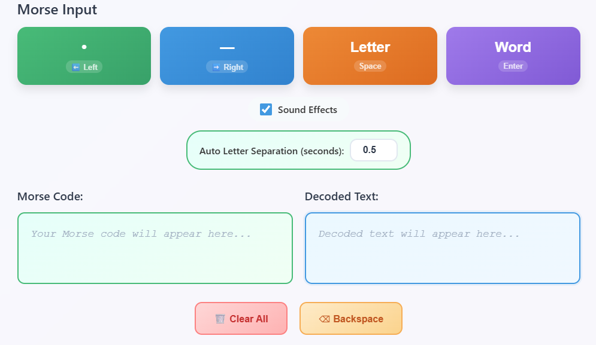
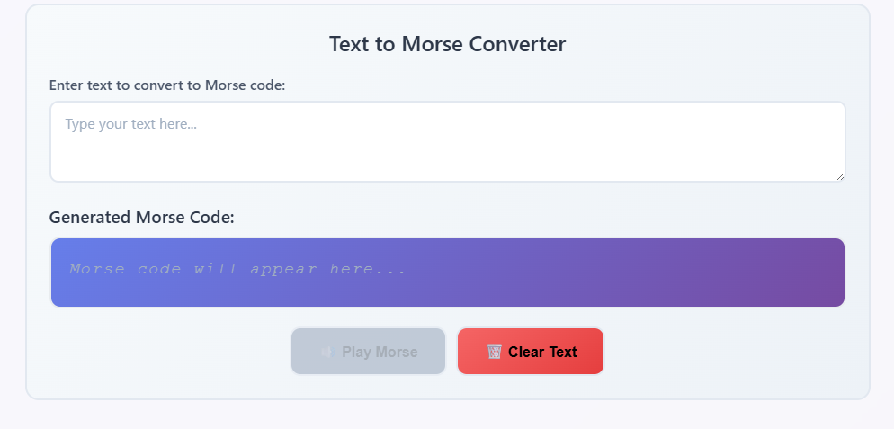

# 🎯 Morse Code Typing App

A modern, interactive web application for learning and practicing Morse code. Features real-time conversion, audio feedback, and an intuitive keyboard interface.

## 📸 Screenshots

### Main Interface

### Text to Morse Converter

## ✨ Features

- **Interactive Morse Input**: Use arrow keys for easy input (Left = DOT, Right = DASH)
- **Real-time Conversion**: See your Morse code converted to text instantly
- **Audio Feedback**: Customizable sound effects for dots and dashes
- **Text to Morse**: Convert regular text to Morse code with audio playback
- **Auto Letter Separation**: Configurable timing for automatic letter separation
- **Morse Code Reference**: Built-in interactive reference chart
- **Responsive Design**: Works on desktop, tablet, and mobile devices
- **Keyboard Shortcuts**: Full keyboard support for efficient typing
- **Clean Interface**: Modern, user-friendly design

## 🚀 Getting Started

### Quick Start
1. Clone this repository or download the files
2. Open `index.html` in your web browser
3. Start typing Morse code using the arrow keys!

### No Installation Required
This is a pure HTML/CSS/JavaScript application with no dependencies. Simply open the HTML file in any modern web browser.

## 🎮 How to Use

### Morse Code Input
- **Left Arrow Key (⬅️)**: Input DOT (•)
- **Right Arrow Key (➡️)**: Input DASH (—)
- **Spacebar**: Manually separate letters
- **Enter**: Separate words
- **Backspace**: Delete last Morse symbol
- **Escape**: Clear all input

### Mouse Controls
- Click the DOT and DASH buttons for touch/mouse input
- Use the clear and backspace buttons
- Toggle sound effects on/off

### Text to Morse Converter
- Type any text in the input field
- See the Morse code equivalent displayed below
- Click "Play Morse Audio" to hear the code

### Settings
- **Sound Effects**: Toggle audio feedback on/off
- **Auto Letter Separation**: Adjust timing (0.1-5 seconds) for automatic letter separation when you pause

## 🎵 Audio Features

- **Dot Sound**: Short, high-pitched beep (200ms, 800Hz)
- **Dash Sound**: Longer, lower-pitched beep (600ms, 400Hz)
- **Morse Playback**: Play any text as Morse code audio
- **Browser Compatible**: Uses Web Audio API for consistent sound across browsers

## 📱 Responsive Design

The app works seamlessly across:
- **Desktop**: Full keyboard and mouse support
- **Tablet**: Touch-friendly interface
- **Mobile**: Optimized for smaller screens

## 🎯 Learning Features

- **Interactive Reference Chart**: Click any letter/number to see its Morse code
- **Real-time Feedback**: See your input converted immediately
- **Visual Timing Indicator**: Shows auto-separation countdown
- **Progress Tracking**: See your current letter and full decoded text

## 🛠️ Technical Details

- **Frontend**: HTML5, CSS3, JavaScript (ES6+)
- **Audio**: Web Audio API
- **No Dependencies**: Pure vanilla JavaScript
- **Browser Support**: All modern browsers
- **File Size**: Lightweight (~50KB total)

## 📋 Morse Code Reference

The app includes the complete International Morse Code alphabet:
- **Letters**: A-Z
- **Numbers**: 0-9
- **Punctuation**: Common symbols (., , ? ' ! / ( ) & : ; = + - _ " $ @)

## 🤝 Contributing

Contributions are welcome! Feel free to:
- Report bugs
- Suggest new features
- Submit pull requests
- Improve documentation

## 📄 License

This project is licensed under the MIT License - see the [LICENSE](LICENSE) file for details.

## 🔗 Usage Examples

### Learning Morse Code
1. Start with simple letters like E (•) and T (—)
2. Use the reference chart to learn new letters
3. Practice with the auto-separation feature

### Practicing Speed
1. Turn on sound effects for audio practice
2. Adjust auto-separation timing to match your speed
3. Try converting full sentences

### Teaching Tool
- Great for classrooms and educational environments
- Visual and audio learning combined
- Interactive reference makes learning engaging

## 🚀 Future Enhancements

Potential features for future versions:
- Speed tracking and statistics
- Custom practice sessions
- Import/export functionality
- Multiple sound themes
- Prosigns (procedural signals) support

---

**Made with ❤️ for Morse code enthusiasts and learners everywhere!**
